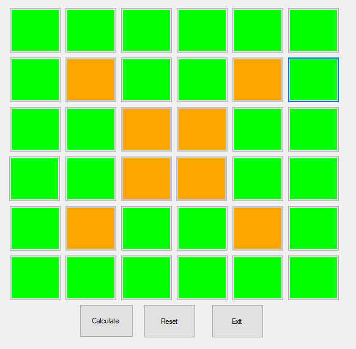
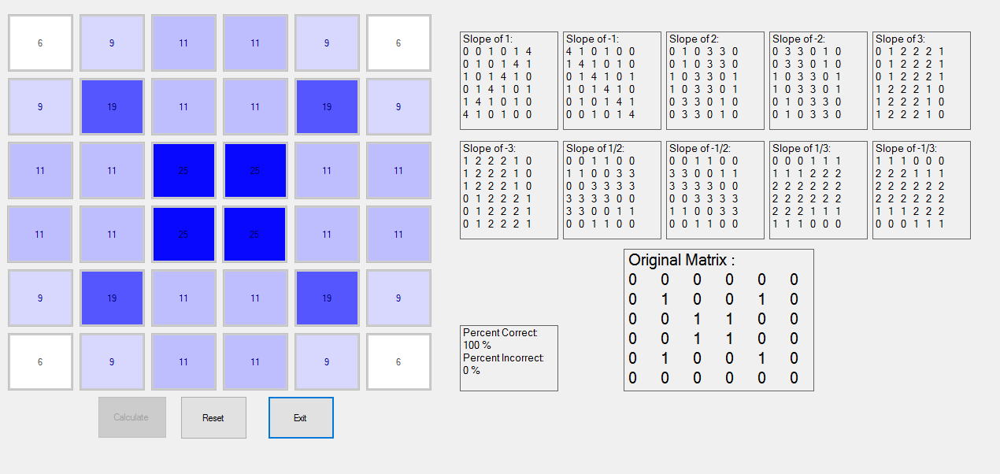

# Abstract Simulation of a CT Scan
## About

A CT scan, or CAT scan, is a type of X-ray scan. CT stands for Computerized Tomography, 
which is a digital technique for displaying cross sections of living tissue or other objects. 
In this program, the user will input a shape that they want on a 6x6 matrix, and the program 
will generate a CT scan of the shape. It will do this by simulating light transmitted at 
different angles, using 10 different slopes which go through the shape on the matrix. Using 
these slopes, it will generate 10 intermediate matrices. These matrices will be shown using a 
timer. Finally, the corresponding individual cells in each of the 10 matrices will be added 
together, resulting in a CT scan that accurately displays the shape and density of the original 
shape.

##Screenshots:

Input:

Output:

##Running the application
I've attached an .exe of the original Visual Basic Project
